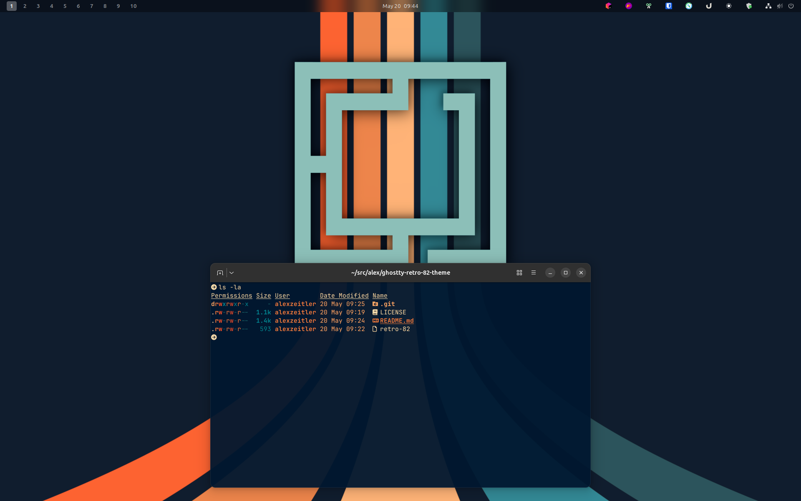

# ghostty-retro-82-theme

Retro-futuristic [Ghostty](https://ghostty.org) theme with a deep navy base,
warm amber accents, and cyan/teal support tones. Port of the
[omarchy-retro-82-theme](https://github.com/OldJobobo/omarchy-retro-82-theme)
palette.

## Preview


## Palette

| Token          | Hex       |
| -------------- | --------- |
| `background`   | `#00172e` |
| `foreground`   | `#f6dcac` |
| `cursor`       | `#f6dcac` |
| `selection bg` | `#faa968` |
| `red`          | `#f85525` |
| `orange`       | `#faa968` |
| `orange (dim)` | `#e97b3c` |
| `teal`         | `#028391` |
| `teal (dim)`   | `#3f8f8a` |
| `cyan`         | `#8cbfb8` |

## Install

Drop the `retro-82` file into Ghostty's themes directory and set it as your
theme.

```bash
curl -fsSL https://raw.githubusercontent.com/AlexZeitler/ghostty-retro-82-theme/master/retro-82 \
  -o "$XDG_CONFIG_HOME/ghostty/themes/retro-82"
```

Then in `~/.config/ghostty/config`:

```
theme = retro-82
```

Or clone the repo and symlink:

```bash
git clone https://github.com/AlexZeitler/ghostty-retro-82-theme.git
ln -s "$PWD/ghostty-retro-82-theme/retro-82" "$XDG_CONFIG_HOME/ghostty/themes/retro-82"
```

## Credits

Palette and design by [@OldJobobo](https://github.com/OldJobobo) (see
[omarchy-retro-82-theme](https://github.com/OldJobobo/omarchy-retro-82-theme)).
Palette feedback by [@niraletter](https://github.com/niraletter).
